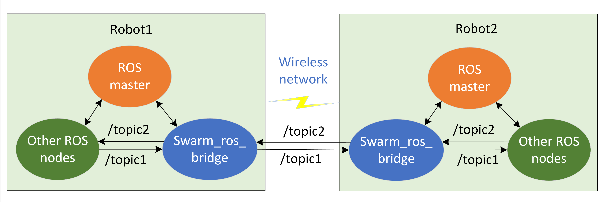
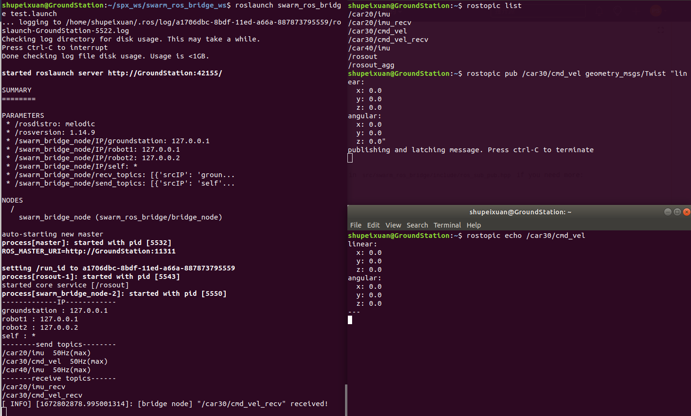

# swarm_ros_bridge

## Introduction

A lightweight middle interface ROS package mainly based on [ZeroMQ](https://zeromq.org). It enables the specified ROS messages transmission among swarm robots through socket communication. The purpose of this package is to replace the traditional way of [running ROS across multiple machines in ROS1](https://wiki.ros.org/ROS/Tutorials/MultipleMachines), which has some drawbacks under swarm robots situation.

An example of two ROS robots communicating with each other through swarm_ros_bridge is shown below:



Compared with ROS1 multi-robot wireless communication, it has the following benefits:

-  **Robust**: No need for base station ROS master launching first. Support each robot launching in a random sequence and connecting each other autonomously.

-  **Flexible**:  You can choose the sending/receiving ROS topics rather than transferring all topic (names) as ROS1 does.

-  **Easy to use**:  Specify all the IP and ROS topics in one configuration file.

Compared with ROS2 DDS communication, it may have the following benefits:

-  **Lightweight**: It is a small ROS bridge node subscribing and sending remote ROS topics, so connecting with other ROS nodes is easy.
-  **Reliable**: It uses ZeroMQ socket communication based on TCP protocol while ROS2 is based on DDS, whose default protocol is UDP (unreliable). DDS is mainly designed for data exchange between native processes under wired communication rather than remote wireless communication.

ROS wiki page: https://wiki.ros.org/swarm_ros_bridge

source code: https://github.com/shupx/swarm_ros_bridge.git

csdn blog (in chinese): https://blog.csdn.net/benchuspx/article/details/128576723


## Structure

```bash
└── swarm_ros_bridge
    ├── CMakeLists.txt
    ├── config
    │   └── ros_topics.yaml  # Config file to specify send/receive ROS topics
    ├── include
    │   ├── bridge_node.hpp  # Header file of bridge_node.cpp
    │   ├── ros_sub_pub.hpp  # Header file for different ROS message type.
    ├── launch
    │   └── test.launch
    ├── package.xml
    └── src
        └── bridge_node.cpp  # @brief Reliable TCP bridge for ros data transfer in unstable network.
                             # It will send/receive the specified ROS topics in ../config/ros_topics.yaml
                             # It uses zmq socket(PUB/SUB mode), which reconnects others autonomously and
                             # supports 1-N pub-sub connection even with TCP protocol.
```


## Install

**Supported platforms/releases**:

| Platform                                                   | ROS Release                                                    |
| ---------------------------------------------------------- | -------------------------------------------------------------- |
| [Ubuntu 16.04 Xenial](https://releases.ubuntu.com/16.04.4/) | [ROS Kinetic](https://wiki.ros.org/kinetic/Installation/Ubuntu) |
| [Ubuntu 18.04 Bionic](https://releases.ubuntu.com/18.04/) | [ROS Melodic](https://wiki.ros.org/melodic/Installation/Ubuntu) |
| [Ubuntu 20.04 Focal](https://releases.ubuntu.com/20.04/) | [ROS Noetic](https://wiki.ros.org/noetic/Installation/Ubuntu) |

**Install process**:

```bash
## clone this package
mkdir -p swarm_ros_bridge_ws/src  # or your own ros workspace
cd swarm_ros_bridge_ws/src
git clone https://gitee.com/shu-peixuan/swarm_ros_bridge.git
# or 'git clone https://github.com/shupx/swarm_ros_bridge.git'

## install dependencies
sudo apt install libzmqpp-dev
# or 'rosdep install --from-path swarm_ros_bridge/'

## build
cd ../
catkin_make
source devel/setup.bash
```


## Usage

1. Specify the IP and ROS topic information in `config/ros_topics.yaml`. 

- For the sending topic, IP is self IP (* for example) and port should be different as it binds to the "tcp://*:port". 
- For the receiving topic, IP and port should be the remote source IP and port as it connects to the "tcp://srcIP:srcPort".

- The `max_freq` will limit the sending frequency once it exceeds `max_freq`. Set `max_freq` large enough if you do not want to decrease the sending frequency.

2. Launch the bridge_node:

```bash
roslaunch swarm_ros_bridge test.launch # local machine test
```

3. Publish messages into send_topics and check that remote recv_topics are receiving these messages. The console will also print INFO the first time recv_topics receive messages.


We also provide a simple latency test demo between two machines. Please refer to [scripts/README.md](https://github.com/shupx/swarm_ros_bridge/tree/master/scripts/README.md)


## Advanced

### * More ROS message types

The default supported ROS message types are only `sensor_msgs/Imu` , `geometry_msgs/Twist` and `std_msgs/String`. If you need more types:

1. Modify the macros about MSG_TYPEx and MSG_CLASSx in `include/ros_sub_pub.hpp`, then it will generate template functions for different ros message types.  

```cpp
// In ros_sub_pub.hpp
// uncomment and modify the following lines:
#include <xxx_msgs/yy.h>
#define MSG_TYPE4 "xxx_msgs/yy"
#define MSG_CLASS4 xxx_msgs::yy
```

We support up to 10 types modification. If that is still not enough, then you should modify the `topic_subscriber()`, `topic_publisher()` and `deserialize_publish()` in `include/ros_sub_pub.hpp` according to their styles.

2. Add the dependent package in find_package() of `CMakeLists.txt`:

```sh
# in CMakeLists.txt
find_package(catkin REQUIRED COMPONENTS
  roscpp
  std_msgs
  geometry_msgs
  sensor_msgs
  xxx_msgs
)
```

3. Recompile:

```bash
cd swarm_ros_bridge_ws/
catkin_make
```

### * More send_topics

We support up to 50 send_topics. Modify the following lines in `include/ros_sub_pub.hpp` if you need more.

```cpp
// in ros_sub_pub.hpp
# define SUB_MAX 50 // max number of subscriber callbacks
//...
template <typename T>
void (*sub_callbacks[])(const T &)=
{
  sub_cb<T,0>, sub_cb<T,1>, ... //add more
};

```

Then recompile:

```bash
cd swarm_ros_bridge_ws/
catkin_make
```

## Future Work

1.  Dynamic RPC, including dynamic node discovery, online topic change, and ground station monitor.
2.  Support UDP protocol for mass data transmission like video streams. 
3.  Support ROS service transmission with ZeroMQ request-reply mode.
4.  Support ROS2 topic and service transmission.


## Contributor

Peixuan Shu (shupeixuan@qq.com), PhD, beihang university, China, 2023.1.1

This package is personally developed by Peixuan Shu (PhD, beihang  university, China) on Jan. 2023. Any question/suggestion is welcomed at [swarm_ros_bridge issue](https://github.com/shupx/swarm_ros_bridge/issues) or [shupeixuan@qq.com](mailto:shupeixuan@qq.com). 

Some applications:

 **pyugvswarm** : a python package wrapper around unmanned ground vehicle (UGV) swarm positioning / communication / control ROS1 nodes. https://pyugvswarm.readthedocs.io/en/latest/overview.html


